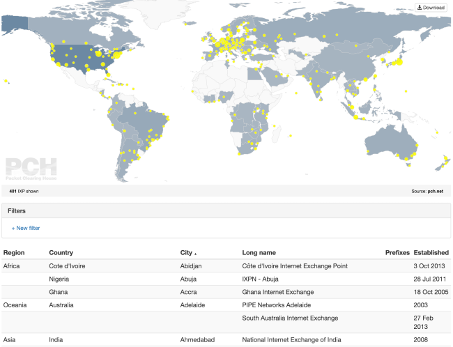

MapTable
========

This library was originally conceived to render the [home page](https://pch.net) and next generation of [IXP directory](https://pch.net/ixpdir) for Packet Clearing House ([PCH](https://pch.net)). It's primary function is to convert any dataset to a customizable set of components of Map, Filters and Table:
- **Map** - A fully customizable SVG map which dynamically responds to filters and can be exported to a stand alone SVG for external consumption
- **Table** - A tabular representation of your dataset which can be sorted by header rows. This also dynamically responds to filters.
- **Filters** - A programmatically generated list of drop downs and input fields to drill down into your dataset

[Demo →](http://packet-clearing-house.github.io/maptable/)



## Dependencies

- [D3.js](https://d3js.org/)
- TopoJSON*: [homepage](https://github.com/mbostock/topojson) or [download (cdnjs)](https://cdnjs.com/#q=topojson)

\* Only used if you need a map

## Install

### Browser

Here is minimum amount of HTML to render a MapTable with Map, Filter and Table.

```html
<div class='vizContainer'></div>

<script src="d3.min.js"></script> <!-- You can import it from cdnjs.com -->
<script src="topojson.min.js"></script> <!-- You can remove this line if you're not using the map --> <!-- You can import it from cdnjs.com -->
<script src="maptable.min.js"></script> <!-- You can import it from cdnjs.com -->
<script>
  var viz = d3.maptable('#vizContainer')
              .csv('/examples/data/ixp.csv')
              .map({ path: '/examples/maps/world-110m.json' }) // You can remove this line if you want to disable the map
              .filters() // You can remove this line if you want to disable filters
              .table(); // You can remove this line if you want to disable the table
              .render(); // This is important to render the visualization
</script>
```
MapTable is available on cdnjs.com. Remember though, cool kids concatenate their scripts to minimize http requests.

If you want to style the MapTable elements with some existing styles, you can prepend the above HTML with:

```html
<link rel="stylesheet" href="https://maxcdn.bootstrapcdn.com/bootstrap/3.3.5/css/bootstrap.min.css">
<link rel="stylesheet" href="/maptable.css">
```

### Bower

If you're running [Bower](http://bower.io/), you can install maptable like this:

```shell
bower install --save maptable
```
Notable files are: `build/maptable.min.js` `build/maptable.css`

## Naming conventions

For clarity, we define `viz` as the variable that instantiate Maptable.

Functions that have `d` as parameter, means that `d` is a dictionary that contain data for one row.

Functions that have `groupedData` as parameter, means that `groupedData` is a dictionary `{ key: 'groupedByKey', values: [ {...d...} ] }` that contain grouped data.

## ScaledValue

We use this type to change the attributes of markers and countries.

It can be static value, for example a hex color for `countries.attr.fill = '#FFFFFF'`.

Or if the value of the attribute is depending on the data, the expected value would be an object as explained below.

For example, for the map options on `countries.attr.fill`, if we want to have countries background color to be related to a scale from green to red, and be white if the country don't have any related data. The value should be:

```js
{
  min: 'green',
  max: 'red',
  empty: 'white',
}
```

If you want to attach the data boundaries to the value of an attribute. For example, for the map options on `markers.attr.r`, if we want to have markers radius to be related to a scale from minimum value and the maximum value, but also transform the value following a function. The value should be:

```js
{
  min: 'minValue',
  max: 'maxValue',
  transform: function (val) {
    return Math.sqrt(val);
  },
}
```

## Declaring MapTable elements

To create a visualization (Map or/and Table or/and Filters) of your dataset, you need to provide first the container of your visualization

```html
<div id='vizContainer'></div>
```

The default order of the 3 components is `Map`, `Filters` and `Table`. If you want to place the components in a different order, you can put them on the main container:

```html
<div id='vizContainer'>
  <div id='mt-map'></div>
  <div id='mt-filters'></div>
  <div id='mt-table'></div>
</div>
```

You instantiate the MapTable library into the `viz` variable based on the `#vizContainer` ID you declared in the DOM:

```html
<script>
  var viz = d3.maptable('#vizContainer'); // #vizContainer is the css selector that will contain your visualization
</script>
```

### Import datasets

Datasets can be defined by using one of the these three sources:

\# `viz.json(url)`

Import JSON file at the specified url with the mime type "application/json".

\# `viz.csv(url)`

Import CSV file at the specified url with the mime type "text/csv".

\# `viz.tsv(url)`

Import TSV file at the specified url with the mime type "text/tab-separated-values".

### Dataset requirements

In order to plot your dataset on a map, there are minimum set of columns needed. They are `latitude`, `longitude` for your markers coordinates, and `country_code` for the countries that are in [ISO_3166-1_alpha-3](https://en.wikipedia.org/wiki/ISO_3166-1_alpha-3#Officially_assigned_code_elements) format:

```json
[
    {"longitude":"13.23000", "latitude":"-8.85000", "country_code":"ANG"},
    {"longitude":"168.32000", "latitude":"-17.75000", "country_code":"VUT"},
]
```

You can also edit these keys name using the map options `longitudeKey`, `latitudeKey` and `countryCodeKey`

### Columns details

By default, MapTable imports all the columns and detects their format automatically. As well, you can customize behaviors of specific columns and create virtual columns.

\# `viz.columns(columnsDetails)`

#### columnsDetails format

- `<PUT_YOUR_COLUMN_KEY>:` _(Object)_ Provide the columns key here to apply the options below to it. If this key is not defined in yoru dataset, then it will be dynamically added as virtual column:
    - `nowrap:` _(bool, default: false)_ When present, it specifies that the content inside a that column should not wrap.
    - `title:` _(string, default: columnKey)_ What we show as column name in filters and table.
    - `type:` _(string, default: 'field')_ Column format type, used for filtering. Available options:
        - `field`: filter by keyword
        - `dropdown`: exact match using a dropdown
        - `number`: filter using comparison (≥, ≤, between ....)
        - `custom`: custom format that we will define with the option `dataFormat`
   - `dataFormat:` _(function(d))_ Used only when `type` is _custom_. Function that return the new formatted data.
   - `cellContent:` _(function(d))_ Function that return what we will show on the table cell.

### Map

If you want to add a Map on your visualization:

\# `viz.map(options)`

#### Options

- `path:` _(string, **required**)_ URL of the TOPOJSON map, you can get them from Mike Bostock's repo: [world atlas](https://github.com/mbostock/world-atlas) and [us atlas](https://github.com/mbostock/us-atlas).

*Example:* `path: "maps/world-110m-wo-antarctica.json",`

- `zoom:` _(bool, default: true)_ Enable zoom on the map (when scrolling up/down on the map).
- `legend:` _(bool, default: false)_ Enable map legend (that would show the color scale with minimum and maximum datapoints per country).
- `title:` _(object, default: *see below*)_ Add a title within the map.
    - `title.bgColor:` _(string, default: '#000000')_ Title font size.
    - `title.fontSize:` _(integer, default: 12)_ Title font size.
    - `title.fontFamily:` _(string, default: 'Helevetica, Arial, Sans-Serif')_ Title font family.
    - `title.content:` _(function(countShown, countTotal, filtersDescription)_ Function to define how the title is rendered
    - `title.source:` _(function())__ Function to define how the HTML in the title.

*Example:*
```js
title: {
  bgColor: "#F5F5F5",
  fontSize: "11",
  content: function(countShown, countTotal, filtersDescription) {
    if (countShown === 0 || countTotal === 0) out = "No IXP shown";
    else if (countShown < countTotal) out = 'Showing <tspan font-weight="bold">' + countShown + '</tspan> IXP from <tspan font-weight="bold">' + countTotal + "</tspan>";
    else out = '<tspan font-weight="bold">' + countTotal + "</tspan> IXP shown";

    if (c !== '') out += " — " + filtersDescription;
    return out;
  },
  source: function() {
    return 'Source: <a xlink:href="http://www.pch.net/" target="_blank"><tspan font-weight="bold">pch.net</tspan></a>';
  }
},
```

- `scaleZoom:` _([integer, integer], default: [1, 10])_ The map zoom scale.
- `scaleHeight:` _(float, default: 1.0)_ Ratio to scale the map height.
- `autoFitContent:` _(bool, default: true)_ Enable auto zoom to focus on the active markers.
- `fitContentMargin:` _(integer, default: 10)_ Padding in pixels to leave when we filter on a specific area.
- `tooltipClass:` _(string, default: 'popover bottom')_ Class name of the tooltip (we're using bootstrap).
- `ratioFromWidth:` _(float, default: 0.5)_ Ratio between the height and the width: height/width, used to deduce the height from the the width.
- `countryCodeKey:` _(string, default: 'country_code')_ Column name of the ISO_3166-1_alpha-3 country code (from the dataset).
- `longitudeKey:` _(string, default: 'longitude')_ Column name of the longitude (from the dataset).
- `latitudeKey:` _(string, default: 'latitude')_ Column name of the latitude (from the dataset).
- `exportSvg:` _(string, default: null)_ URL endpoint to download the current visualization as SVG. Read more on the section export SVG. (more details on a the section "Export as SVG")
- `watermark:` _(object, default: null)_ Add a watermark within the map.
    - `watermark.src:` _(string)_ URL of the image (svg, png, jpg).
    - `watermark.width:` _(integer)_ Image width.
    - `watermark.height:` _(integer)_ Image height.
    - `watermark.position:` _(string)_ Watermark position (top|middle|bottom) (left|middle|right). e.g. `bottom left`.
    - `watermark.style:` _(string)_ Additional css style for the watermark.

*Example:*
```js
watermark: {
  src: 'https://www.pch.net/assets/img/pch_logo.svg',
  width: 130,
  height: 60,
  position: "bottom left",
  style: "opacity:0.1"
},
```
- `markers:` _(object, default: null)_ Add markers on the map.
    - `markers.groupBy:` _(function(d))_ Function that returns a string that we use to group markers on the dataset.
    - `markers.rollup:` _(function(groupedData))_ Function that returns a value that we would use for every marker. We will use it to set the radius of the markers.
    - `markers.customTag:` _(function(markerObject)), default: null)_ This is more advanced feature. If you'd like to override the default market tag (svg:circle) to something different (like an image), you can use this callback function to append to the markerObject your custom implementation (see below example). x and y are coordinates in pixels of the marker.
    - `markers.attrX:` _(string, default: 'cx')_ Attribute to position the marker on the X-Axis
    - `markers.attrY:` _(string, default: 'cy')_ Attribute to position the marker on the Y-Axis
    - `markers.attrXDelta:` _(integer, default: 0)_ Left relative margin of the marker
    - `markers.attrYDelta:` _(integer, default: 0)_ Top relative margin of the marker
    - `markers.tooltip:` _(function(d))_ Function that returns html that we would use as content for the tooltip. We recommend you to use the bootstrap popover. If we using groupBy, the parameter is going to be `groupedData`, otherwise it's `d` (check above on the naming conventions for more details).
    - `markers.attr:` _(object)_ Markers attributes (same naming as svg attributes).
        - `markers.attr.fill:` _(ScaledValue)_ Marker background color.
        - `markers.attr.r:` _(ScaledValue)_ Marker radius.
        - `markers.attr.stroke:` _(ScaledValue)_ Marker border color.
        - `markers.attr.stroke-width:` _(ScaledValue)_ Marker border width.

*Example (grouping by value):*

```js
markers: {
  groupBy: function(a) {
    return a.city + ", " + a.country;
  },
  rollup: function(a) {
    return a.length;
  },
  tooltip: function(a) {
    out = '<div class="arrow"></div>';
    out += '<span class="badge pull-right"> ' + a.values.length + '</span><h3 class="popover-title"> ' + a.key + '</h3>';
    out += '<div class="popover-content">';
    for (i = 0; i < a.values.length; i++) out += " • " + a.values[i].long_name + "<br>";
    out += "</div>";
    return out;
  },
  attr: {
    r: {
      min: "minValue",
      max: "maxValue",
      transform: function(v) {
        return 3 * Math.sqrt(v);
      },
    },
    fill: "yellow",
    stroke: "#d9d9d9",
    "stroke-width": 0.5
  }
},
```
*Example (with custom tag - Advanced feature):*


```js
markers: {
  className: 'starsMarker',
  customTag: function(markerObject){
    return markerObject.append("svg:image")
      .attr("xlink:href", "https://www.pch.net/assets/img/star.svg")
      .attr("width", "13")
      .attr("height", "27");
  },
  attrX: 'x',
  attrY: 'y',
  attrXDelta: -6,
  attrYDelta: -13
},
```

- `countries:` _(object, default: null)_ Add countries on the map.
    - `countries.rollup:` _(function(groupedData))_ Function that returns a value that we would use for every country.
    - `countries.tooltip:` _(function(groupedData))_ Function that returns html that we would use as content for the tooltip. We recommend you to use the bootstrap popover. The parameter is `groupedData` (check above on the naming conventions for more details).
    - `countries.attr:` _(object)_ Markers attributes (same naming as svg attributes).
            - `countries.attr.fill:` _(ScaledValue)_ Marker background color.
            - `countries.attr.r:` _(ScaledValue)_ Marker radius.
            - `countries.attr.stroke:` _(ScaledValue)_ Marker border color.
            - `countries.attr.stroke-width:` _(ScaledValue)_ Marker border width.

*Example*

```js
countries: {
  rollup: function(a) {
    return a.length;
  },
  tooltip: function(a) {
    out = '<div class="tooltip-arrow"></div>';
    out += '<div class="tooltip-inner">';
    out += 'In ' + a.key + " PCH serves " + a.values.length + " IXP";
    if(a.values.length > 1){
      out += "s";
    }
    out += ": <hr>";
    for(i=0; i< a.values.length; i++){
      out += a.values[i].name + "<br>";
    }
    out += "</div>";
    return out;
  },
  attr: {
    fill: {
      min: "#a9b6c2",
      max: "#6c89a3",
      empty: "#f9f9f9",
    },
    stroke: "#d9d9d9",
    "stroke-width": 0.5
  },
},
```

## Filters

If you want to add filters on your visualization:

\# `viz.filters(options)`

### Options

- `show:` _([string, ...], default: null)_ Set the order and the columns that we want to see in the filters.

## Table

If you want to add a table on your visualization:

\# `viz.table(options)`

### Options

- `className:` _(string, default: 'table table-striped table-bordered')_ Table class name
- `show:` _([string, ...], default: null)_ Set the order and the columns that we want to see in the table.
- `rowClassName:` _(function(d), default: null)_ Function that returns the row class name depending on its content. Useful to highlight rows.
- `defaultSorting:` _(object, default: see below)_ How we sort things on the table.
    - `defaultSorting.key:` _(string, default: <first column shown>)_ default sorting on which column.
    - `defaultSorting.mode:` _(string, default: 'asc')_ sorting mode: `asc` for ascending, `desc` for descending.
- `collapseRowsBy:` _([string, ...], default: null)_ Array of columns that we want to be collapsed.


## Export as SVG

You can enable this feature to allow users download the map on their computer as SVG. However, you would need to set up a server endpoint that is going to allow users download the SVG file. The sample code for a PHP server is located in `/server/downloadSvg.php`

Contribution are welcomed for implementations in other languages.

## Credits
 * Mohammed Elalj @melalj


## Contribute

You are welcomed to fork the project and make pull requests.

## Todo

 * [ ] Top priority! Write unit tests
 * [ ] Improve documentation
